```{r setup, include=FALSE}
knitr::opts_chunk$set(  
  fig.retina = 3,
  echo = TRUE,
  eval = TRUE,
  warning = FALSE,
  message = FALSE)
```

# 1. Introduction

For the Dataviz Makeover exercise, the task is to critic and make improvements on the existing Tableau visualisation that can be found [**here**](https://public.tableau.com/app/profile/tskam/viz/prototype1_16468762782120/Dashboard1). The visualisation shows the total number of bus trips that starts and ends from a subzone in Singapore based on either weekday or weekends and holidays by the time of hour of the day. Another visualisation shows the adjacency matrix of the percentage of total trips from a subzone for the different destination subzones in Singapore. The purpose of the visualisation is to see how the public bus transport network is like in Singapore.

# 2. Evaluation of graph

## 2.1 Clarity

### 2.1.1 No Main Title and Subtitle explaining the purpose of Dashboard

The main title and subtitles are important for users to understand the purpose of the dashboard. It should consist of a short write up on what users can discover from the dashboard.

### 2.1.2 Day Type Labels not shown clearly

The *Day Type* labels for the column charts have been cut off for weekends/holiday. Placing them at 90 degrees will help to show the entire axis label clearly.

### 2.1.3 Mean line absent for barcharts

Having a mean line to show the average number of trips to and from a subzone would be a good reference for people to gauge which hours in the day have higher or lower total trips.

### 2.1.4 NULL value option seen on filters

NULL values do not show any useful information for users and it can be confusing to users who do not know what it means and its purpose in the chart. It can be omitted out to reduce clutter as well as there are many subzones for users to select.

### 2.2.5 The Time Per Hour Scale does not show midnight trips

The time in the scale does not start at 0. This will give users the wrong impression that there are no midnight bus trips which is untrue based on the data given. 

### 2.2.6 No subtitles for each individual chart

The subtitle of each chart is used to give a short and clear description on what is represented by the chart. Without it, the user might not know what the chart is trying to convey.

### 2.2.7 Cramp adjacency matrix makes it impossible to see colour differences for different destination subzones

The adjacency matrix is too cramp to be able to see the colour differences in the matrix. The colour differences are important to see the differences in the percentage of total bus trips between different destination subzones for each origin subzone for users to do comparison.

### 2.2.8 Adjacency Matrix for Weekend/Holiday has been cut off

The adjacency matrix for weekend/holiday plot has been cut off and does not show all the data. This means that the information shown is incomplete and hence, have to be fixed to provide a full picture for users. One reason why it might have been cut off is probably due to the very large adjacency matrix as it is showing all Originz subzone and Destination subzone.

## 2.2 Aesthetics

### 2.2.1 No subzone labels on Adjacency Matrix 

No subzone labels can be seen for both axis. Either it is too small to be seen or it has been omitted, the label should be shown clearly for users to easily identify the origin or destination subzone for easier referencing when looking at the adjacency matrix.

### 2.2.2 Barcharts have the same colour

The weekday and weekend/holiday barcharts have the same colour, making it hard for users to differentiate them. Using different colours for each chart will make it easier for reading and with colours, the day type axis labels can be removed. A small legend will be used instead. Using the same colour scheme for all charts for weekdays and weekend/holidays throughout the dashboard also allows user to easily pick out the visualisation of interest more readily.

### 2.2.3 Adjacency Matrix only shows percent total of trips from Origin Subzone to Destination Subzone

The title of the adjacency matrix does not clearly show that the information shown is only for trips from Origin subzone to Destination subzone. This makes it difficult for users to understand what the numbers mean. It would be better to state in the chart title which percent total has been calculated.

### 2.2.4 Hard for users to see where each subzones are in Singapore

Without a map of Singapore, for people who are unfamiliar with the subzones in Singapore, it would be hard to see trends of bus trips in different regions of Singapore. Having a map of Singapore and showing the adjacency matrix on the map would give a better perspective of how the public bus network is like in Singapore for different subzones.

## 2.3 Interactive Design

### 2.3.1 Adjacency Matrix Tooltips

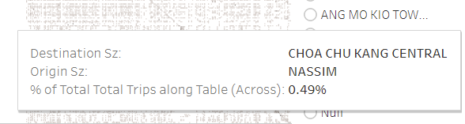{width=50%}

Having a proper text for each element in the tool tips will help user understand the data better. The last information, *'% of Total Total Trips along Table (Across)'* is not clear on what the percentage value is about. It would be better to change it to *'% of Total trips from Origin Subzone'*. 

### 2.3.2 Use Origin Subzone filter for Adjacency Matrix

Currently, all subzones are shown for the adjacency matrix. It would be better to allow users to filter subzones based on origin subzone. This would allow users to filter based on which subzones they are interested in and easily see the differences in the percent total of trips between the different destination subzones.


# 3. Alternative Data Visualisation

For the alternative data visualisation, the focus will be to fix the issues on clarity and aesthetics that were mentioned above. 

1. The charts will still be split by weekdays and weekends/holidays, however, blue colour will be used to represent charts that belong to weekdays and for weekends/holidays, orange will be used. This would enable users to easily identify which charts belong to the same *'Day type'*. The same colour scheme will be applied on the adjacency matrix. Using colour to differentiate the *Day Type* will also help to provide more space for the charts as the axis labels can be removed.

2. The adjacency matrix will now be shown in the form of a map of Singapore. A filter will be used for user to select the Origin subzone of interest. This filter will be linked to the *'Total Bus Trips from < Origin_sz >'* barchart for better interactivity.

3. A main title and subtitle of the dashboard will be added to explain the overall purpose for it and descriptions will be added in the subtitles for each of the charts and the purpose behind them will be added as well.

4. A reference line showing the average number of bus trips will be added to the barcharts to give user a better idea on which hours of the day have higher or lower number of bus trips.

5. The *Time of the day (Hours)* axis will include the midnight hours which are missing in the current data visualisation to give a clearer picture on the trends of bus trips throughout the day.

### 3.1 Sketch of Proposed Visualisation

Below shows the sketch of the visualisation that will be done.

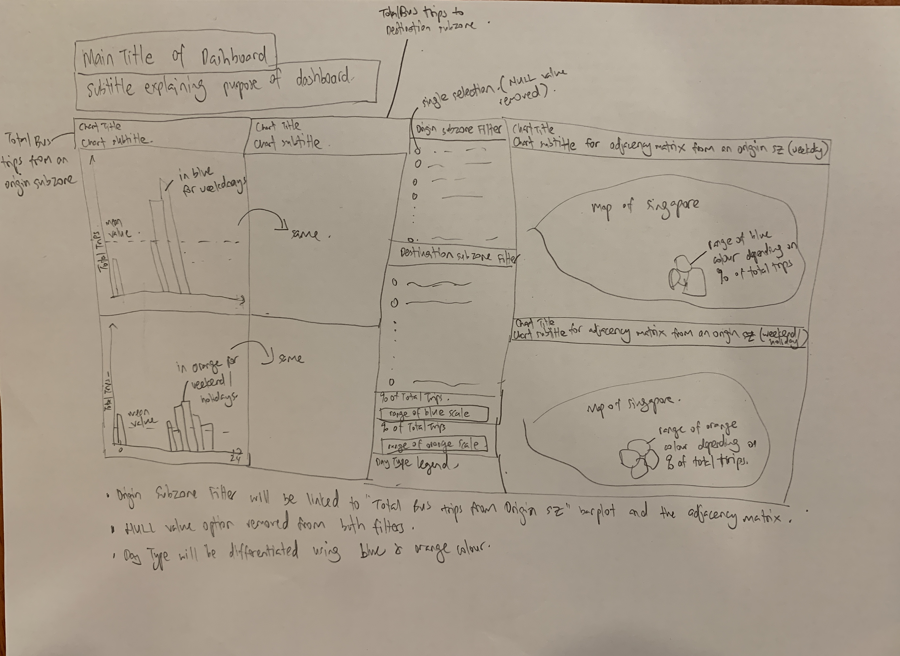{width=70%}

### 3.2 Final Visualisation

The final visualisation dashboard is shown below. It can also be found [**here**](https://public.tableau.com/app/profile/tskam/viz/prototype1_16468762782120/Dashboard1)

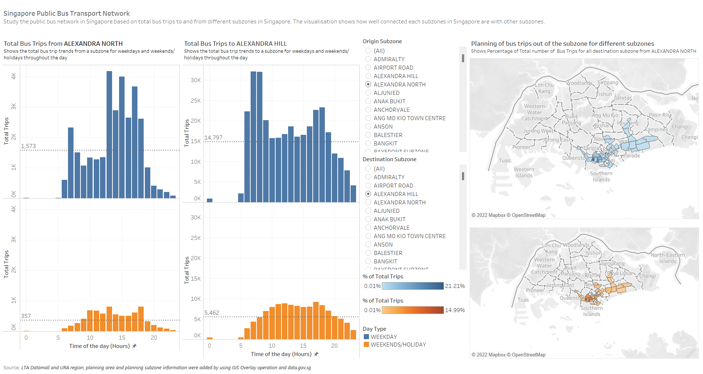{width=70%}

# 4. Observations

1. Observing the adjacency matrix for both weekdays and weekends, the darker colours are usually found just outside of the origin subzone. The bus trips going out of the subzones are mostly in the same planning region with a few trips that go much further out of 2 subzone radius. This is probably due to the Land Transport Authority's new master plan for 2040 to have a 45-Minute City with 20-Minute towns. To achieve this, public transports, including public buses, will have to provide a more seamless connection. The public bus transport purpose is therefore used to increase connectivity within a town while the MRT is used to connect between towns.

2. Another observation is that the peak hours for public buses in residential subzones like Kovan are at 7am and 6pm which coincides with the timing when people go to work and get off from work on weekdays. As for weekends, there is no extreme peaks seen as compared to weekdays as most people do not work on weekends. An interesting observation is that the total bus trips barchart from a subzone and to a subzone has a general trend where they are somewhat mirror images of each other. This makes sense as most people will have to go out of their subzones to get to work in the morning and by evening, they will be taking the bus home towards the subzone where they stay. It shows how the bus trips have been arranged to cater to the needs of the subzone during the peak hours on weekdays. 
As for weekends, there are generally more bus trips in and out of the subzones from 10am to 8pm where people will be going out during the weekends during this period of the day.
Below shows the total bus trips from and to Kovan throughout the day.

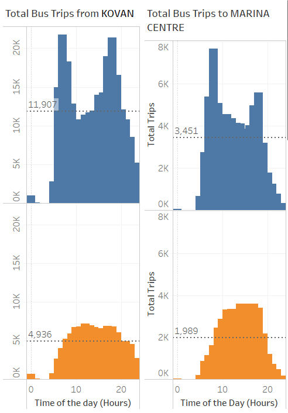{width=50%}

3. As for subzones where offices and industrial areas are, the trend differs from residential subzone areas. Looking at the total bus trips from and to Marina Centre where it is around the CBD area, it is observed that in the morning peak hours, there are relatively fewer buses coming out of Marina Centre while the peak of bus arrivals into Marina Centre is in the morning. This is due to people from the residential subzones entering the area to go to work. As there are little to no residential areas in this subzone, there will not be a high volume of bus trips out of these subzones. For weekends, as Marina Centre is around the shopping malls and tourist sites, there are more bus trips going into and out of this subzone in the afternoon.

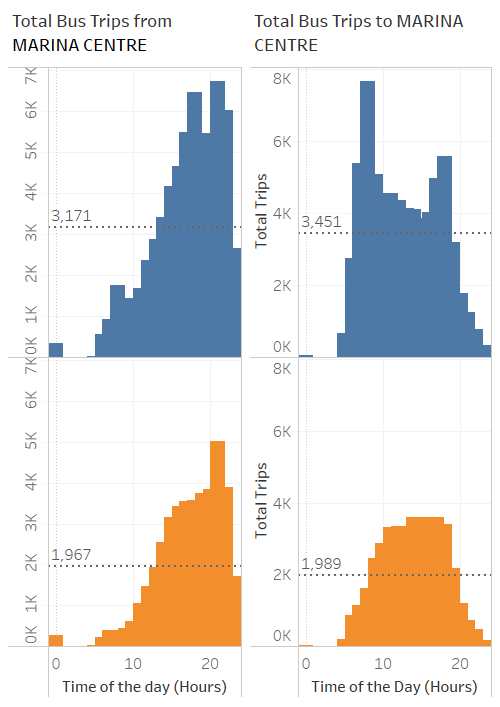{width=50%}

# 5. Preparation of Visualisation

### 5.1 Linking data source with map file

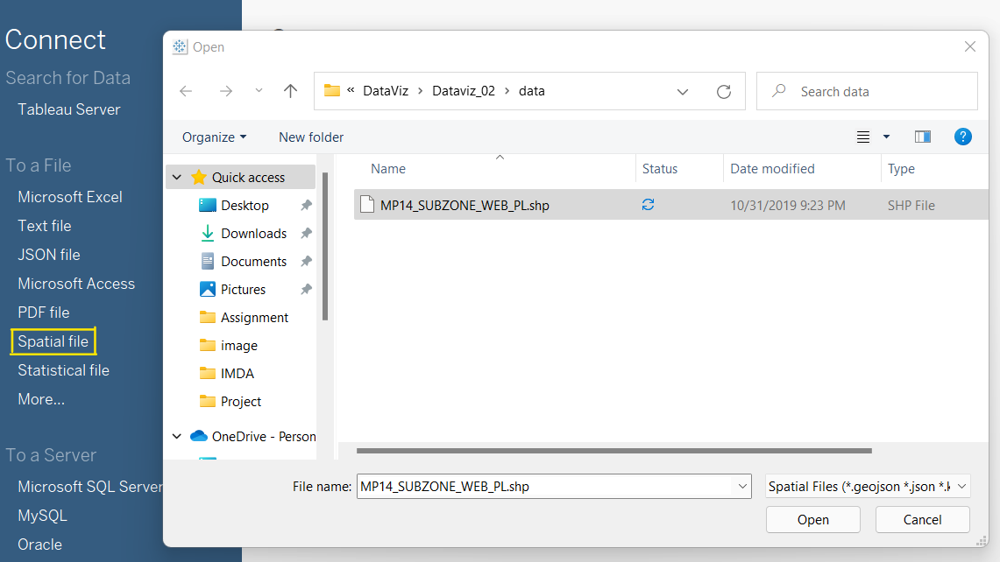{width=50%}

1. Open Tableau and select *'Spatial file'* from the main page as shown above.
2. Browse to where the spatial file has been saved in and choose *'MP14_SUBZONE_WEB_PL.shp'* file

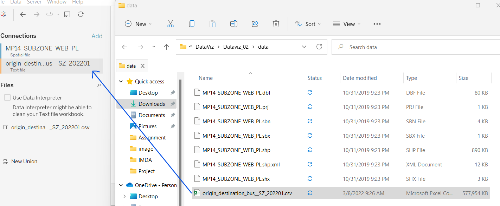{width=50%}

3. Drag the file *'origin_destination_bus__SZ_202201.csv'* into Tableau. Follow the blue arrow as shown above.

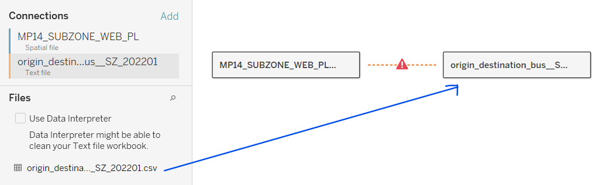{width=50%}

4. Drag the *'origin_destination_bus__SZ_202201.csv'* and link it to the map file as shown by the blue arrow above. A red triangle with an exclamation mark will be shown, which means the relationship between the map file and data set needs to be set.

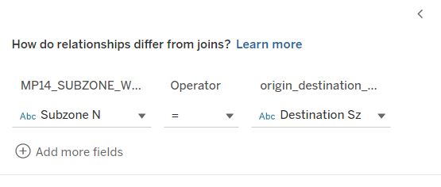{width=50%}

5. Select the *Subzone N* column for *'MP14_SUBZONE_WEB_PL'* and *Destination Sz* column for *'origin_destination_bus__SZ_202201.csv'* to join the two table.

### 5.2 Create Total Bus Trips Barcharts

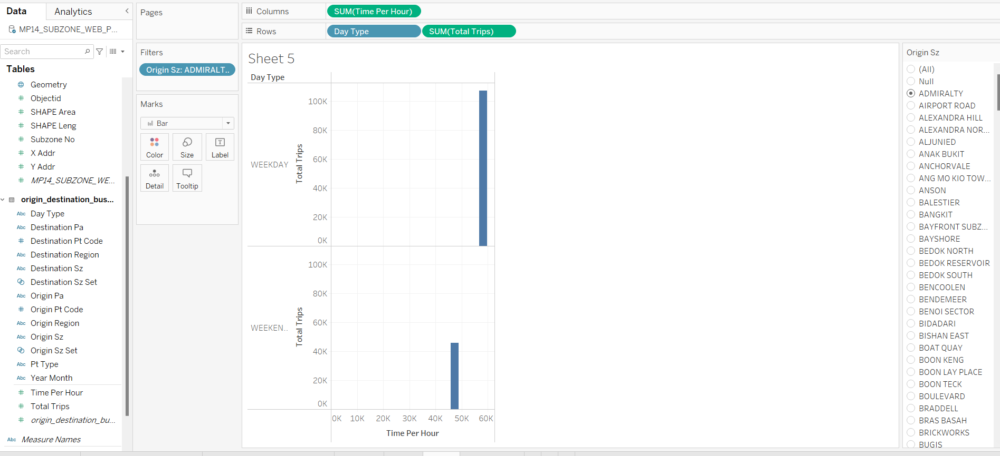{width=50%}

1. Pull all the columns into the fields as shown above. From the above initial plot, it can be seen that the NULL option is still in the filter selection and there is only 1 bar due to the *Time per Hour* being summed up. We will have to change the attribute for *Time per Hour*, change the colours for weekdays and weekends/holidays and remove the *NULL* option in filter

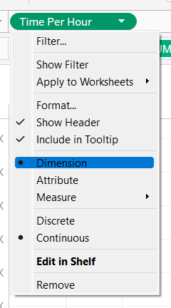{width=30%}

2. Click on the small arrow button at the Columns > Time Per Hour and select *Dimension*. The graph will change as shown below.

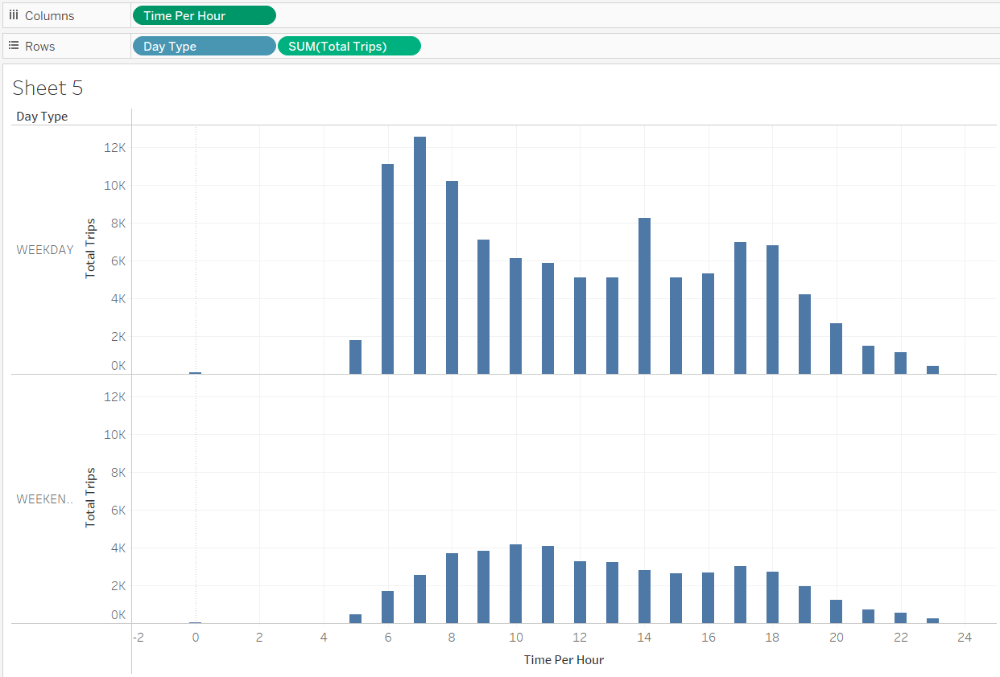{width=50%}

3. To allocate different colours for the *Day Type*, pull the *Day Type* column to *Color* under *Marks*.

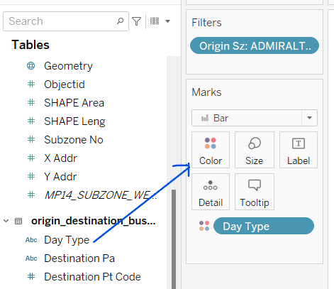{width=50%}

4. As colour is used to differentiate weekdays and weekends/holiday, the axis labels can be removed to create more space for the final dashboard. Click the arrow button on *Day Type* in *Rows* section and untick the *Show Header* option.

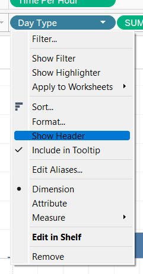{width=30%}

5. The *Time Per Hour* scale will be changed to show from -1 to 24 and axis label will be changed to *Time of the day (Hours)*. Click on the Time Per Hour axis > Right click to show options and select *Edit Axis*. In the *Edit Axis* prompt, select *'Fixed'* range and key in -1 and 24. Change Axis Title to *'Time of the day (Hours)'*.

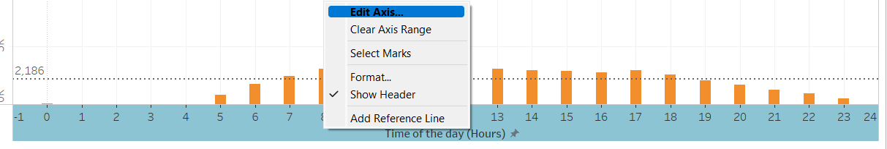{width=50%}

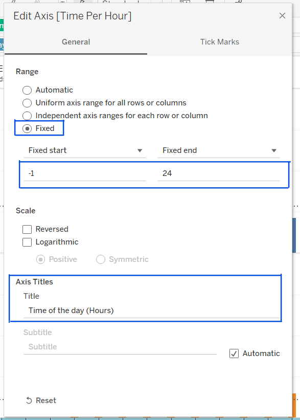{width=50%}

The graph will look like below after making the above changes.

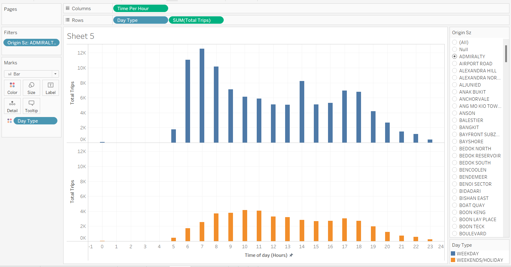{width=50%}

6. To remove the NULL option in filter, we will have to create a set and select all options except *NULL*. Click on the small arrow in *Origin Sz* column as shown below > go to *Create* and select *Set*. In *Create Set*, select *All* first, untick *NULL* and then click *OK*. A new column called *Origiz Sz Set* will be created.

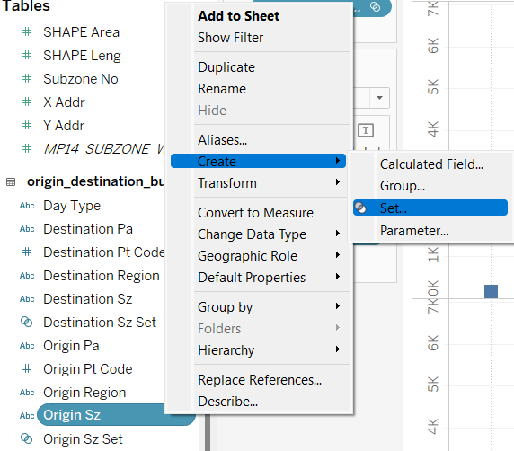{width=50%}

7. We will need to replace existing filter that is using *Origin Sz* to *Origin Sz Set*. Remove *Origin Sz* from Filters and then pull in *Origin Sz Set* to *Filters*. Click on the small arrow of *Origin Sz Set* under *Filters* and select *Show Filter*.

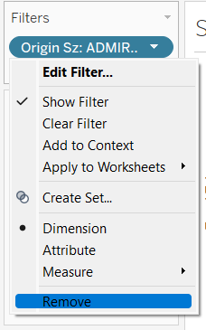{width=30%}

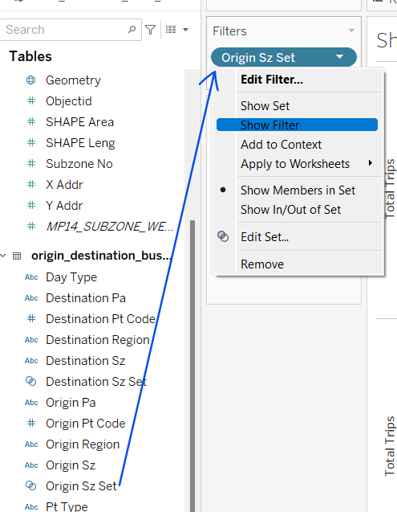{width=50%}

8. Change the filter to allow only single value. Click on the arrow on the filter and select *Single Value (list)*. The *NULL* value is no longer included in the options.

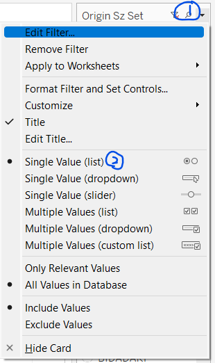{width=30%}

The graph will look as shown below after making the changes.

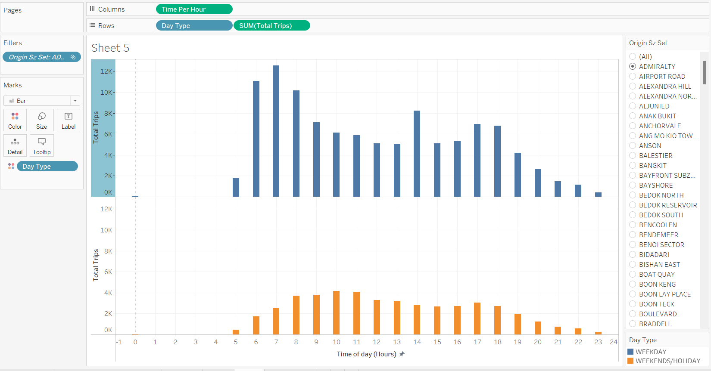{width=50%}

9. We will now add a reference line for user to see the average number of trips throughout the day. To add the reference line, right click on the *Total Trips* axis and select *Add Reference Line*.

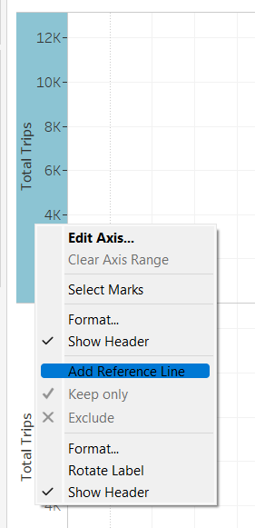{width=30%}

10. Select *Value* in Label.

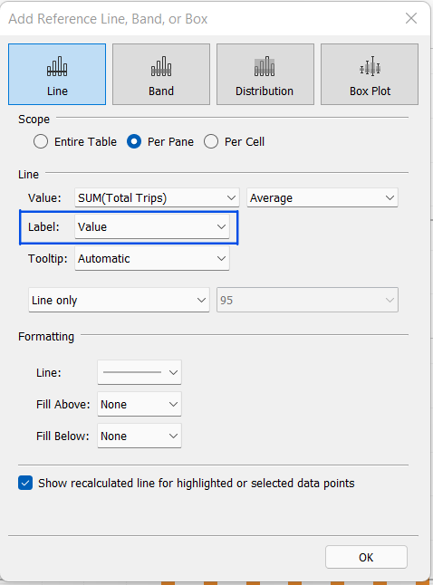{width=50%}

11. The mean value shown for the Reference Line is in 2 decimal places. As the total number of trips should be in integer values, we will now remove the 2 decimal places seen. Right click on the reference line on the chart and select *Format*.

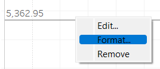{width=30%}

12. Go to *Numbers* > *Number (Custom)* > *Decimal places* and key in 0.

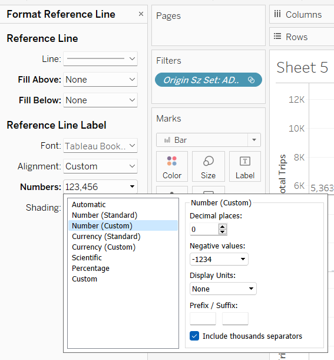{width=50%}

13. Finally, we will change the Main title and Subtitle of the chart to *'Total Bus Trips from < Origin Sz > Shows the total bus trip trends from a subzone for weekdays and weekends/holidays throughout the day'* Final chart is shown as below.

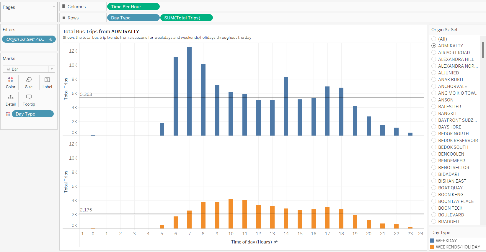{width=50%}

14. Repeat steps 1-13 for Destination Sz to create the barchart for *'Total Bus Trips from < Destination Sz >'*. Just create the Set for* Destination Sz* and pull the new column *Destination Sz Set* to Filters.

### 5.3 Create Map of Singapore with Adjacency Matrix

1. To show the map of Singapore in tableau, pull the *Geometry* column to the plot as shown below.

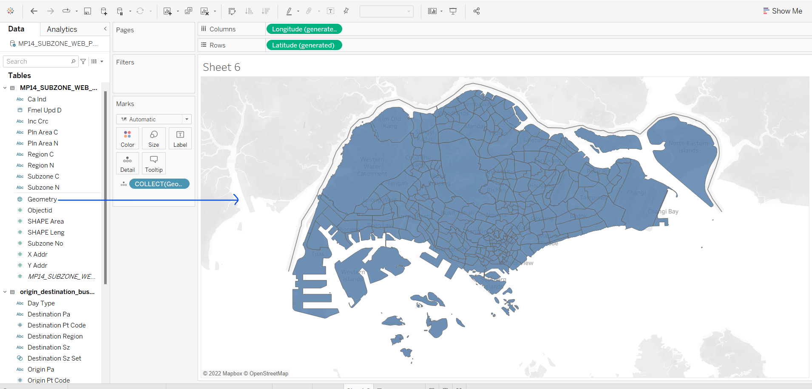{width=50%}

2. We will have to create the adjacency matrix for both weekday and weekend/holiday. The following steps will be done for weekday. For weekend/holiday, a new sheet will be duplicated but the *Day Type* will be selected as Weekend/Holiday instead of Weekday.

3. To create the adjacency matrix, we will first pull the *Total Trips* into *Color* so as to use colours to differentiate how many trips are going out from the subzone. The lighter the colour, the lesser the number of bus trips. Next, pull *Destination Sz* into *Detail* to show the names of each subzone on the map in Tooltips.

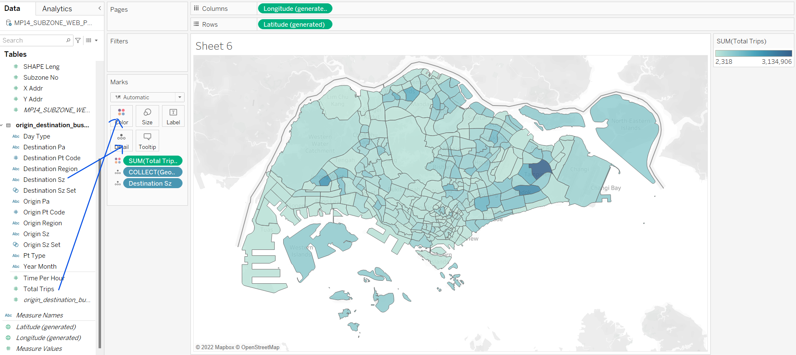{width=50%}

4. Pull *Day Type* column into Filters. A filter prompt will appear. Select *Weekday* and click OK.

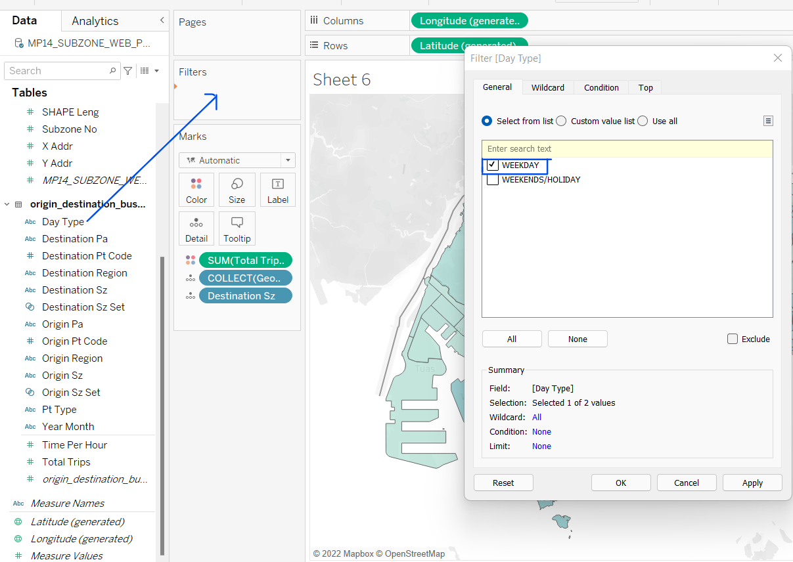{width=50%}

5. We will change the sum of total trips to percent total instead.  This will gives us a better comparison of the total bus trips out of the selected subzone. Click on the arrow on *SUM(Total Trips)* under *Marks* > click *Add Table Calculation*. 

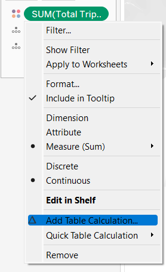{width=30%}

In the Table Calculation box, change *Calculation Type* to *'Percent of Total'* and close the window.

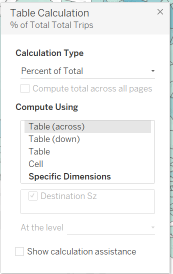{width=30%}

6. Change the colour scheme by double clicking the colour range on the right. This action will bring up the *Edit Colours*. Select *Blue* palette and click OK.

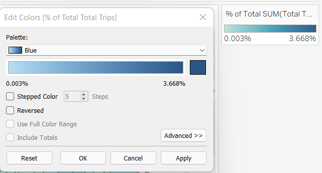{width=50%}

7.To allow users to filter by subzone, *Origin Sz Set* which was created earlier to remove *NULL* option will be dragged into the *Filters* section. Click on the arrow of *Origin Sz Set* under *Filters* and select *Show Filter*. Once filter appears on the right most, click the arrow of the shown filter and select *Single Value (List)* to restrict it to show only 1 choice.

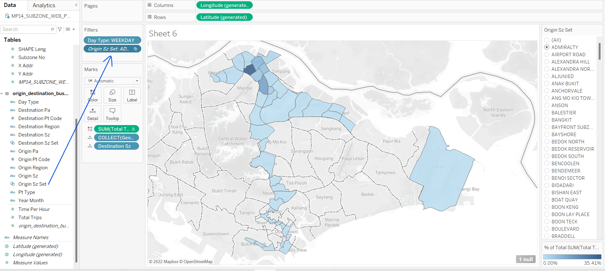{width=70%}

8. Duplicate the current worksheet to create the adjacency matrix for weekend/holiday. This time, change the *Day Type* to weekend/holiday and colour scheme from *Blue* to *Orange*

9. To link the Origin Sz Set filter to all worksheets that are using it , we will have to apply the filter to other worksheet using the same column as a filter. Clink on the small arrow at *Origin Sz Set* filter, go to *Apply to Worksheets* and select *Selected Worksheets*. 

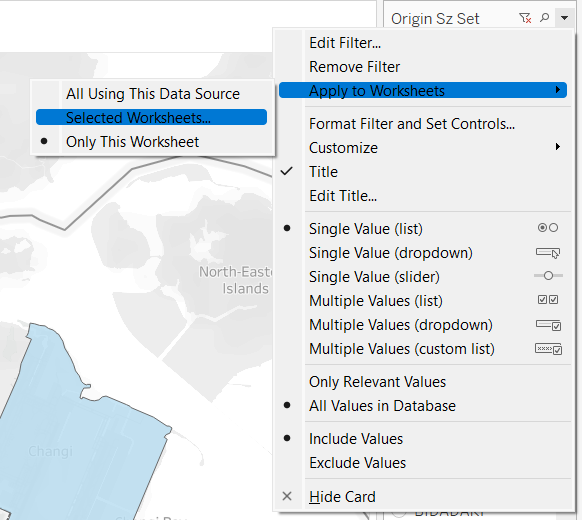{width=50%}

Select both adjacency matrix worksheet and the Trips from worksheet that uses the *Origin Sz Set* filter and click OK.

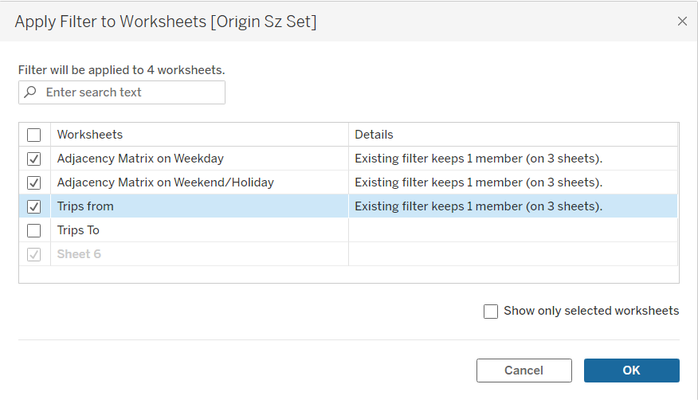{width=50%}

### 5.4 Create the Dashboard

1. Pull all the necessary plots from the worksheet into the dashboard and arranged them according to the picture below.

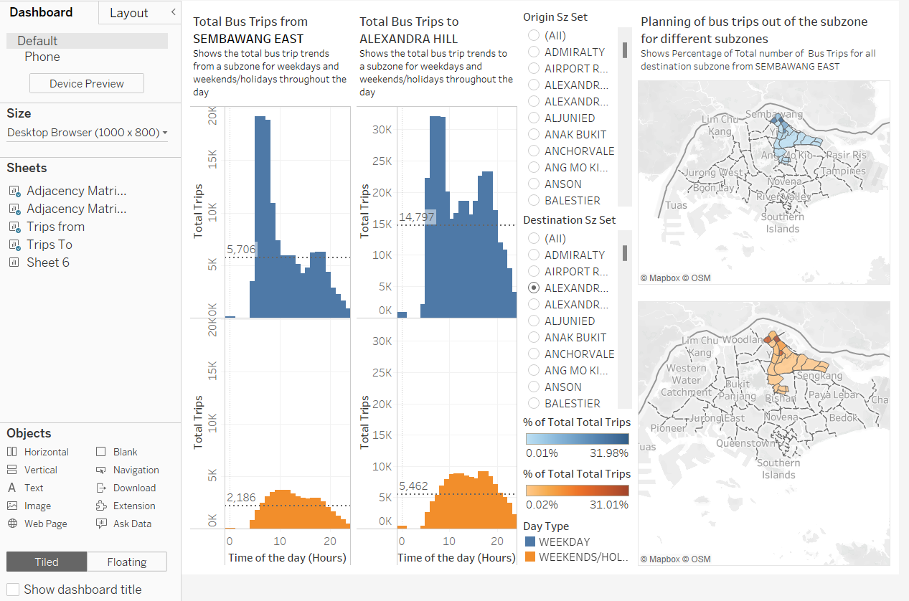{width=50%}

2. To show the legend for the weekend/holiday adjacency matrix, click on the adjacency matrix for weekend/holiday, click on the small arrow, go to *Legends* and click *'Color Legend (% of Total Total Trips)'*. Rearrange the legend as shown above.

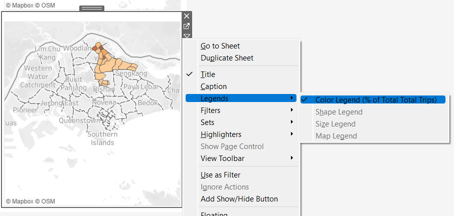{width=50%}

3. Drag the *Text* object the the top of the dashboard and follow the Main title and Subtitle shown in below picture.

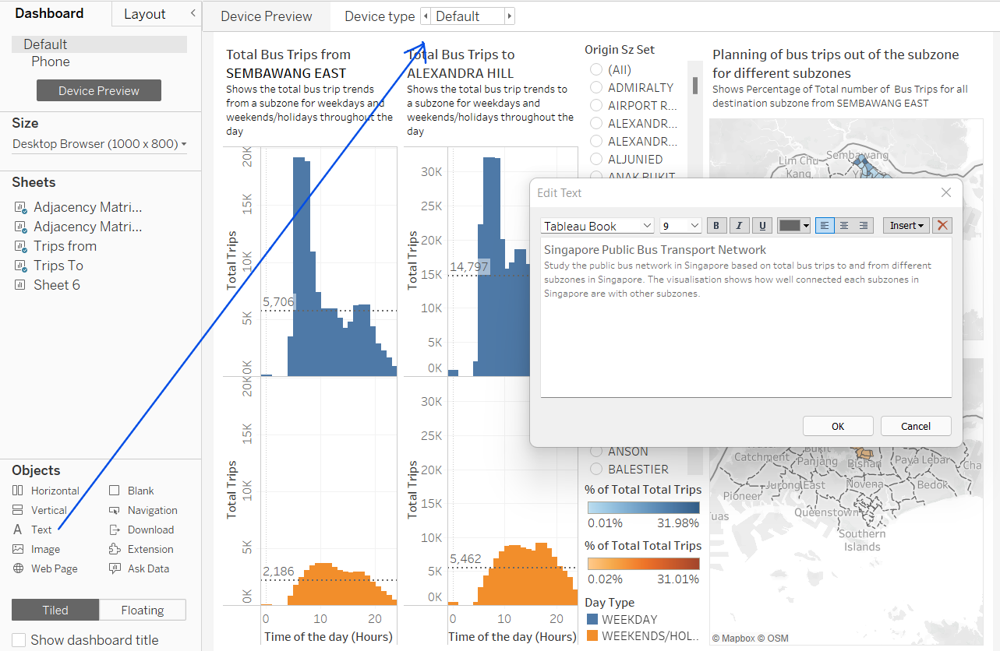{width=50%}

# 6. References

https://www.lta.gov.sg/content/ltagov/en/newsroom/2019/5/2/land-transport-master-plan-2040-bringing-singapore-together.html