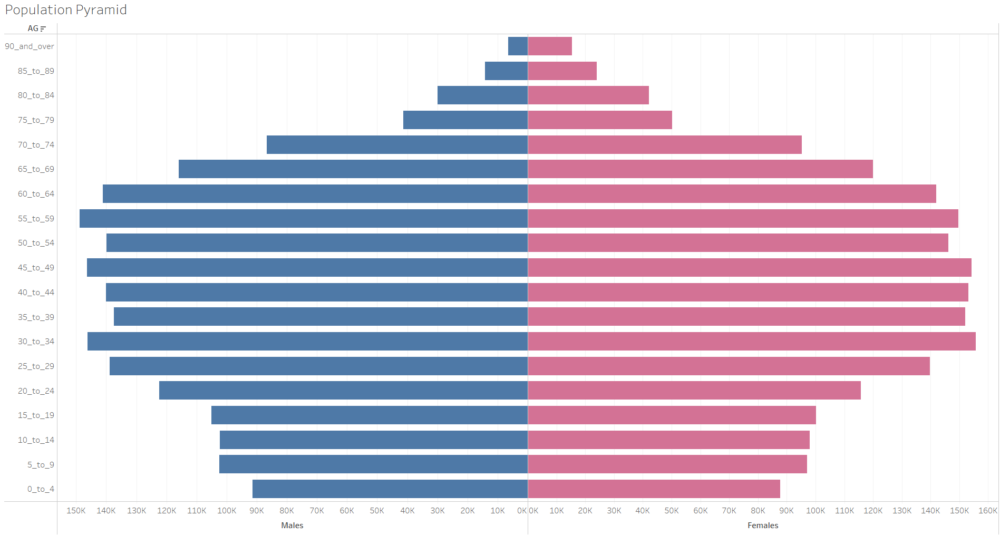

```{r setup, include=FALSE}
knitr::opts_chunk$set(  
  fig.retina = 3,
  echo = TRUE,
  eval = TRUE,
  warning = FALSE,
  message = FALSE)
```
# Introduction to Part 1

A Pareto Chart is useful to identify the most important factor among a set of factors. An example where the Pareto Chart is useful is finding out a business's source of income from different business units and to ensure that the business is not strongly dependent on 1-2 business units. Another example is to identify issues in quality control and to identify the top factors affecting quality. 

R ggplot2 library will be used to plot the Pareto Chart for the total number of returns by item sub-categories.

The Pareto chart done in Tableau is shown here. I will be building the Pareto chart based on the chart that was created in class using Tableau.


### Install and load packages required
```{r}
packages = c('tidyverse', 'readxl')

for(p in packages){library
  if(!require(p, character.only = T)){
    install.packages(p)
  }
  library(p, character.only = T)
}
```

### Read the Orders and Returns data from Superstore-2021.xls file
```{r}
orders <- read_xls("data/Superstore-2021.xls",
                   sheet="Orders")
returns <- read_xls("data/Superstore-2021.xls",
                    sheet="Returns")
```

### Left join the Orders and Returns table by Order ID
Use dplyr to do a left join of Orders table with Returns table using Order_ID. Using a left join will get all data on the left table, which is the Returns table, regardless on whether there is a matching Order_ID in the right table (Orders table). Those that have a matching Order_ID will have the data from Orders table joined with the Returns table.

```{r}
joined_tab <- left_join(returns, orders, 
                        by = c('Order ID'='Order ID'))
```

### Compute frequency count by Sub-Category and arrange in descending order
Get the total count of 'Returned' for each sub-category using the *summarise* function which counts the number of rows after doing a *group-by* function on the sub-category.

```{r}
freq_returned <- joined_tab %>%
  group_by('Sub-Category'=joined_tab$'Sub-Category') %>%
  summarise('Returns'= n()) %>%
  ungroup()
```

As the Pareto Chart is meant to show the most important factors, the counts for each sub-category will be arranged in a descending order for getting the cumulative sum of returns by sub-category in descending order.

```{r}
freq_returned <- freq_returned %>%
  arrange(desc(freq_returned$'Returns'))
```

### Get the cumulative sum of the Returns count
As the Pareto Chart has a line plot that shows the cumulative sum of the factors, the *cumsum* function will be used to get the cumulative sum of the count of the Returns for each sub-category that has already been sorted in descending order. As the plot will be showing the percentage of total running sum of returns, another column to calculate the percentage will be created.

```{r}
freq_returned$cumulative <- cumsum(freq_returned$Returns )
freq_returned$cum_percent <- freq_returned$cumulative/max(freq_returned$cumulative)*100
```

### Plot the Column Chart for the count of Returns for each sub-category.
The difference between a *geom_col()* chart and *geom_bar()* is that a *geom_col()* will represent the height of the bars based on the value of the data while *geom_bar()* will make the heights of the bar proportional to the number of cases in each group. *geom_bar()* requires a statistic count, for eg. sum of weights or count. As the count for each sub-category has been done, *geom_col()* would be more suitable to display the column chart. 

*Note: Using the stat='identity' in geom_bar() will achieve the same results as stat='identity' will create the bar heights based on values in the data*

To ensure that the cumulative line plot corresponds to the height of the Returns count, a scale factor has been calculated which will be used when plotting the cumulative point plot.

A reference line at 80% will allow us to better visualise which sub-categories contribute to 80% of the store's returns.

As the text for the Sub-Categories are long, the text will be turned 90 degrees to make it readable. The background of the plot is lightened to allow the plots to stand out better.

To ensure that the cumulative line plot corresponds to the height of the Returns count, a scale factor has been calculated which will be used when plotting the cumulative point plot. As a 80% reference horizontal line will be drawn to show which sub-categories contribute to 80% of the store's returns, the value with respect to the maximum Returns value will be used as we have scaled the graph based on the maximum Returns value.

```{r}
scalefactor <- max(freq_returned$Returns)/100 #cumulative in % will be at 100%
returns_80 <- 0.8*max(freq_returned$Returns)

```

I will now use ggplot2 to plot the column chart first using the Returns count for the y-axis and sub-categories for the x-axis.

```{r}
p <- ggplot(data=freq_returned, aes(x=reorder(freq_returned$`Sub-Category`, -freq_returned$Returns))) + 
  geom_col(aes(y=freq_returned$Returns), color='blue', fill='blue') 

p
```
Next, i will plot the line graph on the plot for the cumulative sum in percentage. 

```{r}
p <- p + 
  geom_line(aes(y=freq_returned$cum_percent*scalefactor, group=1), color='orange', 
            size= 1) + 
  geom_point(aes(y=freq_returned$cum_percent*scalefactor, group=1), color='black', 
            size= 1) 
p
```
To easily see the 80% value of the cumulative sum, a horizontal reference line will be drawn on the plot.

```{r}
p <- p + 
  geom_hline(yintercept = returns_80, color='grey', linetype=2) 

p
```
Lastly, to make the plot readable, i will change the axis labels, turn the sub-category names 90 degrees, change the background colour to white and label the 80% reference line. To complete the plot, a title and subtitle to explain the plot will be added as well

```{r}
p <- p +
  geom_text(aes(0, y=returns_80, label='80%', vjust = -1, hjust = -18), color='darkgrey') +
  scale_y_continuous(name = 'Returns Count', sec.axis = sec_axis(~./scalefactor, '% of Total Running Sum of Count Returns')) +
  theme(axis.text.x = element_text(angle=90, vjust = 0), panel.background = element_rect(fill='white', color='grey'),
        panel.grid.major.y = element_line(color='grey', linetype = 'dotted')) +
  labs(title= 'Pareto Chart of Returns Count based on Sub-Catergories', subtitle= 'Shows the amount of Returns based on the Items Sold in the Store', x='Sub-Category')

p

```

# Introduction to Part 2
In Part 2 of the Take-home exercise, an age-sex pyramid will be built using R ggplot2. The dataset used will be from the **respopagesextod2021.csv** which was downloaded from the [*Singapore Department of Statistics*](https://www.singstat.gov.sg/find-data/search-by-theme/population/geographic-distribution/latest-data) website.

The age-sex pyramid is useful to show how a country's population is distributed by age and sex. It has two bar charts that represents the number of people in a certain age group shown horizontally side by side, with males represented on the left bar chart and females on the right.

The age-sex pyramid done in Tableau is shown here.



The task for Part 2 of the take-home exercise is to plot out an age-sex pyramid similar to the one shown above.

### Download dataset from CSV file

```{r}

pop <- read_csv("data/respopagesextod2021.csv", show_col_types = FALSE)

```

### Get the total population count for each age group and gender

The *group-by* function will be used to group age group and gender and then the *sum* function is called in the *summarise* function to add the population count in **Pop** column together.

```{r}

pop_count <- pop %>%
  group_by(AG, Sex) %>%
  # group_by('Gender' = pop$Sex) %>%
  summarise('Pop Total' = sum(Pop)) %>%
  ungroup()

```

### Preparing the data for plotting

As the Males population count will be towards the left, a negative sign can be added to the population count for Males. This is done by doing an *ifelse* function to multiply the population total by -1 for all rows where Sex = 'Males'.

```{r}

pop_count$Population <- ifelse(pop_count$Sex == 'Males',
                               -1*pop_count$`Pop Total`,
                               pop_count$`Pop Total`)

```

### Plot the Age-Sex Pyramid Chart

For the plot, two bar charts will be needed where they will display the total population by age group based on Sex. The age group will need to be sorted from the youngest age group to the oldest age group and shown in plot from bottom up. 

```{r}

ggplot(pop_count, aes(x=sort(AG),
                           y= Population,
                           fill= Sex)) + 
  geom_bar(data = subset(pop_count, Sex == 'Males'), stat='identity',
           fill='skyblue') +
  geom_bar(data = subset(pop_count, Sex == 'Females'), stat='identity',
           fill='pink') +
  scale_y_continuous(breaks = 
                       c(-150000,-100000,-50000,0,50000,100000,150000), 
                     labels = 
                       c('150k','100k','50k','0','50k','100k','150k')) + 
  coord_flip() + 
  labs(title = 'Population Pyramid of Singapore', subtitle = 'Shows the decline of birth rates and growing aging population', x = 'Age Group')

```

## Conclusion

The take-home exercise has helped me to realise how easy and simple it is to build visualisation charts in Tableau when compared to R. It is more intuitive as compared to R especially when it comes to sorting data or even just displaying the chart's axis labels. However, using R has its benefits as it is much more customisable and not limited to the features provided by the software supplier (like Tableau or Power BI). R has many functions and methods available to build the same type of charts. One important advantage with using R is that it allows me to fully understand all the steps that is required from data wrangling to visualisation. For example, joining tables and using group by to aggregate the values that is needed. With Tableau, all these aggregation are done behind the scenes, therefore, it is not as easy to understand how these aggregations are done.