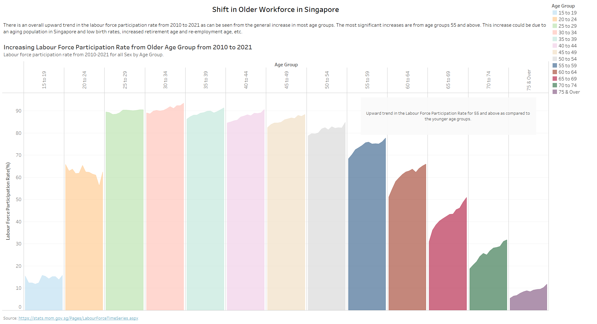
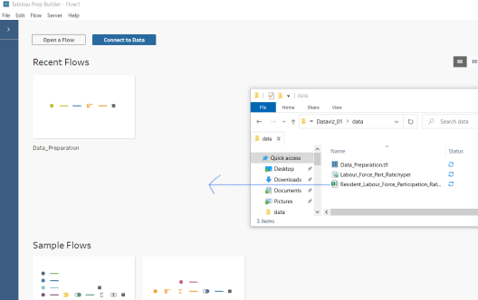

```{r setup, include=FALSE}
knitr::opts_chunk$set(  
  fig.retina = 3,
  echo = TRUE,
  eval = TRUE,
  warning = FALSE,
  message = FALSE)
```

# 1. Introduction

For the DataViz assignment, the following data visualisation will be given a makeover to improve its clarity and aesthetics.


# 2. Evaluation of graph

## 2.1 Clarity

### 2.1.1 Generic Title and Missing Subtitle

The graph is missing a subtitle which makes it difficult to know what message the data visualisation is trying to convey. A subtitle can be used to give a description on what information is to be conveyed by the charts and a clearer title to emphasize on what the plot is about.

### 2.1.2 Redundant Charts

The plots for *70 and over*, *70 to 74* and *75 and over* have redundancy. Charts used should either use only *70 and above* or *70 to 74* and *75 and over* as 70 and over will include the age groups *70 to 74* and *75 and above*. From the data visualisation, as there is an increasing trend in labour force participation rate from age 70 to 74, removing *70 and above* and taking *70 to 74* and *75 and above* would be a better option.

### 2.1.3 Age Group not arranged in order

The plots have been arranged to look like there is an increasing trend in the labour force participation rate. However, there is no link between each age groups and the plot is giving the wrong perception of this by plotting it from smallest to largest participation rate. It would be better to arrange the plots according to age group for viewers to easily find the age group of interest.

### 2.1.4 Separate line charts

Separate line charts make it difficult to see any comparison or differences between each line trend. Placing all the line trends in one chart but using outstanding colours to highlight those of interest would be better.

## 2.2 Aesthetics

### 2.2.1 Age Group Labels

The age group labels at the top x-axis for *75 & Over* and *70 to Over* have been cut, making it difficult to read. It would be better to rotate the labels vertically.

### 2.2.2 Unclear X-axis labels

The bottom X-axis of the plot only shows Year 2015 although the individual age group plots show a line trend. The x-axis does not properly show the range of years used.

### 2.2.3 Y-axis title unit is missing

The label for the Y-axis uses the short-form of Labour Force Participation Rate which is not intuitive for viewers to know what it indicates and the unit of measurement, in this case percentage, is missing. A better y-axis label could be *'Labour Force Participation Rate (%)'*.

### 2.2.4 The coloured area in the plot is not needed

The colours used in the plots do not help to identify any information for viewers and seems to be only used for aesthetic purposes. As the line trend throughout the years for each age group is of interest, a proper line plot should be used instead of an area chart to emphasize on the trend. 

# 3. Alternative Data Visualisation

{width=50%}

The improved visualisation will address the cramp line plots for each age group and to allow viewers to easily compare the trends in labour force participation rate across age groups. It will also show the changes in the labour force participation rate between 2010 and 2021. The colours of the line trends that are of interest will be a darker, more contrasting colour while the others will be changed to a lighter shade of colours. The data shown will also not include *'70 and above'* age group as the *'70 to 74'* and *'75 and above'* age groups will be used instead. A more detailed title and subtitle will also be added to the plots.

The below alternative Data Visualisation addresses the issues that were brought up above and highlight some observation discovered in the data and it is the Final Data Visualisation done in Tableau.

Link to Tableau Public: [Final Data Visualisation](https://public.tableau.com/app/profile/tan.yan.ru/viz/Dataviz-01/Dashboard1)



# 4. Observations

Based on the line trend for the different age groups from 2010 to 2021, there has been a steady upward trend in the participation rate for people who are 55 and above while the younger age group has a relatively constant participation rate. The largest increase in participation rate percentage points between 2010 and 2021 is from the age group 65 to 69. This group of people are at the retirement and re-employment age. The increase could be due to Singapore's government policies to increase retirement and re-employment age to support older people who still wish to continue working. There is also a downward trend seen for the participation rate in age group 20 to 24 which are the group of people that are either have just graduated from Polytechnic or are studying in University. Looking at the line trend for all plots, there is a shift in an older labour force as the participation rate for people below 55 is has a smaller increase in percentage points as compared to those above 55.

# 5. Preparation of Data and Visualisation

## 5.1 Data Preparation using Tableau Prep Builder

Before using the Tableau Prep Builder to clean and prepare the data, row numbers have to be added to the excel sheet to allow for easier extraction of the rows for the different *Sex* in the dataset.

### 5.1.1 Preparing of Excel Sheet

1. Add the *Row* column on the left of the data in sheet, **'mrsd_Res_LFPR_2'** as shown in the image below.
2. Save the Excel File once done.

{width=60%}

### 5.1.2 Tableau Prep Builder

1. Open Tableau Prep Builder
2. Drop the excel file that was saved in the previous step as shown below



The data preparation flow to be done is as shown below.


To add steps to the flow, click the *+* sign next to the icons as shown below.

{width=50%}

**Step 1: Choose fields required**

1. Double click the icon and tick the following field: *Row, Age (Years)/Sex, 2010, 2011, 2012, 2013, 2014, 2015, 2016, 2017, 2018, 2019, 2020 and 2021*

{width=50%}

**Step 2: Filter out rows**

1. Add a new step, choose *'Clean Step'*
2. Double click the Clean Step icon. Create the following filters by following the next step. 
3. Create filter to remove *NULL* values in rows. Select and right click on the *null* value and click on *'Exclude'*

{width=50%}

4. Do the same filtering for row *'70 and above'*. The final filters are shown below.

{width=50%}

**Step 3: Create Columns to Identify rows for Total, Males and Females**

1. Add a new step, choose *'Clean Step'*
2. Create Calculated Fields to mark data rows for *Total, Females and Males*
3. Click on *'Create Calculated Field'*. Click on the *'...'* to look for it if it is not found in the list above the tables.
4. Follow the formula shown below and click *'Save'*

{width=70%}

5. Create two more calculated fields to change the names *Total, Males and Females* to *All* in Age group Column and get the Difference in percentage point for 2010 and 2021. Follow the formulas below.

{width=70%}

{width=70%}

**Step 4: Using Pivot Table**

1. A pivot table will be used to convert the Year columns into rows of data. Add the *Pivot* step in the flow. 
2. Double click the *Pivot* step.
3. Select the *Years 2010 to 2021* and drag it to the *Pivoted Fields* section.


4. Results of the Pivot table will be shown below. Rename *Pivot1 Names* to *Year* and *Pivot1 Values* to *Rate*.


**Step 5: Extract the final fields required**

1. Add *'Clean Step'* to the flow
2. Remove all data rows under *'Males'* and *'Females'* in the *Sex* column. Select *Males* and *Females* value, right click and select *Exclude*


3. Keep the fields *Year, Rate, Age Group and Difference*. Select the fields as shown in the blue box. Right click in one of the selected field and select *Keep Only*


**Step 6: Output the file**

1. Add the *Output* step in flow.
2. Browse the folder to save the file in.
3. Input the name of the file.
4. Run flow when done to get the output file that will be used for creating the visualisation.


## 5.2 Preparation of Data Visualisation

Below explains how to build the plots in Tableau. 

### 5.2.1 Get data into Tableau

1. Go to the folder where the ***Labour_Force_Part_Rate.hyper*** output file was created using the earlier steps done.
2. Drag and drop the file into Tableau.

### 5.2.2 Building of Line Plot

**Step 1: Pull in the fields for *Columns* and *Rows***

1. Open a Worksheet in Tableau.
2. Pull the corresponding fields based on the arrows shown in the image below


 
**Step 2: Edit Y-Axis Label**
 
1. Select the Y-Axis on the plot and right click to open the Menu.
2. Click on 'Edit Axis'
 
{width=30%}
 
3. Change the Axis Title.
 
{width=30%}

**Step 3: Add Annotations to Plot**

1. Select a point on the line. Right click to get the menu, highlight *'Annotate'* and select *'Point'*

{width=30%}

2. Add the text as shown below.

{width=50%}

**Step 4: Exclude 'All' from Plot**

1. At the Legend section, right click on *'All'* and choose *'Exclude'*

{width=30%}

**Step 5: Add Titles and Subtitles to Plot**

1. Add Titles and Subtitles as shown in the Final Line Plot below.


### 5.2.3 Building of Dot and Line Plot

**Step 1: Create Calculated Field to Extract only 2010 and 2021 Rate Values**

1. Right click on the empty space to show the menu and click *'Create Calculated Field..'*

{width=30%}

2. Input the formula shown below and click *'OK'*

{width=50%}

**Step 2: Pull in the fields for *Columns* and *Rows***

1. Pull the following fields and choose *'Line'* to create the first line plot.
2. Adjust the size of the line by selecting *'Size'* and pull slider.


3. Colour palette can be changed for *'SUM(Difference)'* by double clicking the *'SUM(Difference)'* colour scheme in Legends

{width=50%}

4. Pull the *'Rate_2010_2021'* field again to *Rows* to create a second plot.
5. This time, choose 'Circle' to create the dot plot.
6. Pull *'Year'* to *Color*.


**Step 3: Combine the two plots into one**

1. Click on small arrow pointing down in second *'SUM(Rate_2010_2021)'* and select *'Dual Axis'*.
2. Remove the second axis labels by un-ticking *'Show Header'*


2. To make the line plot connect to only the dots under the same Age Group, click the small arrow in the first *'SUM(Rate_2010_2021)'* under *Rows* and select *Dimensions*


**Step 4: Rotate the X-Axis Labels**

1. Right click on an empty area near the X-axis
2. Choose *'Rotate Label'*

{width=30%}

**Step 5: Add Titles and Subtitles to Plot**

1. Add Titles and Subtitles as shown in the Final Plot below.


