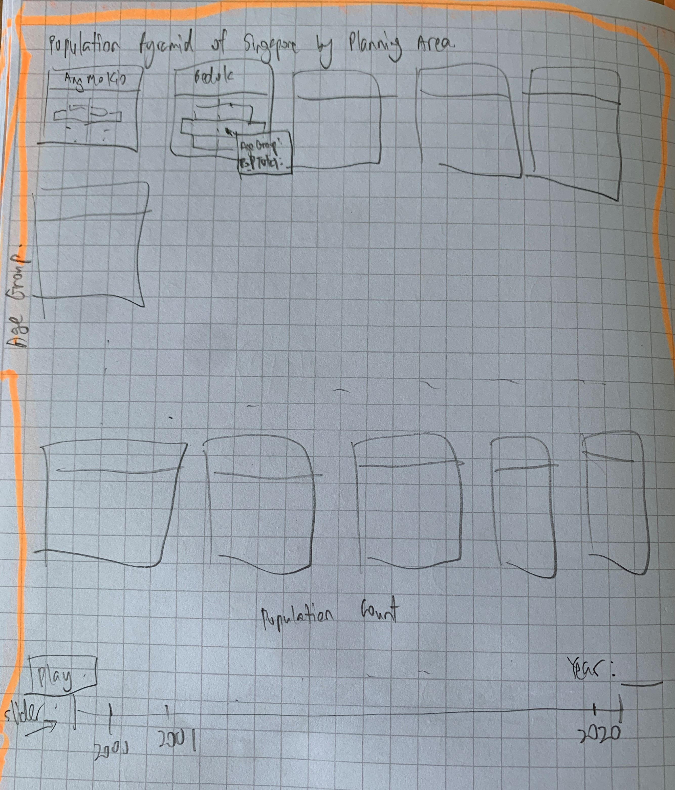

```{r setup, include=FALSE}
knitr::opts_chunk$set(  
  fig.retina = 3,
  echo = TRUE,
  eval = TRUE,
  warning = FALSE,
  message = FALSE)
```

# 1. Introduction

In the last take-home exercise, an age-sex pyramid was built by grouping the population count by sex and age group for Year 2021 and the plot was a static plot with no interaction or animation. For this take-home exercise, the datasets used will be the *Singapore Residents by Planning Area / Subzone, Age Group, Sex and Type of Dwelling 2000-2010* and *Singapore Residents by Planning Area / Subzone, Age Group, Sex and Type of Dwelling 2011-2020* to show interactivity and animation of the plots. For interactivity, the plan is to add tooltips that will show more information as user hovers the mouse above each bar chart. As for animation, the chart will show the changes that have been occurring with the population count for each Age Group Sex at the Planning Area level through the years 2000 to 2020.

### 1.1 Sketch of Charts to be done

The age-sex pyramid for each planning area will be done using the *facet_wrap()* function in *ggplot* to be able to arrange the plots nicely and to be able to link them to a slider where user will be able to manually control which Year to see. There will be a **Play** button to allow animation to run. The animation will show the changes in population demographic throughout the years 2000 to 2020.



# 2. Data Preparation

### 2.1 Import all libraries required
```{r}
packages = c('ggiraph', 'plotly', 
             'DT', 'patchwork',
             'gganimate', 'tidyverse',
             'readxl', 'gifski', 'gapminder')

for(p in packages){library
  if(!require(p, character.only = T)){
    install.packages(p)
  }
  library(p, character.only = T)
}
```

### 2.2 Read in data in CSV

Read in both CSV files use *read_csv* function and use *bind_rows* function to combine them into one dataframe.

```{r}
pop_2010 <- read_csv("data/respopagesextod2000to2010.csv", 
                     show_col_types = FALSE)

pop_2020 <- read_csv("data/respopagesextod2011to2020.csv", 
                     show_col_types = FALSE) 

pop <- bind_rows(pop_2010, pop_2020)
```

### 2.3 Check for Zero Total Population for Planning Area

As we are interested in the changes in demographic structure in Singapore at planning area level, areas with **zero** total population will be excluded from the plots as there is no information to be gathered from showing the plots of these planning areas. Hence, we will first check if there are any planning areas that have zero total population for all years.

```{r}
check_pop <- pop %>%
  group_by('Planning Area' = pop$PA) %>%
  summarise('Total Pop' = sum(Pop)) %>%
  ungroup()

pop_eq_0 <- filter(check_pop, check_pop$`Total Pop` == 0)

pop_eq_0

```
From the above table, 13 of the planning area have **zero** total population count throughout the years. In this case, these planning areas will be omitted from the final table.

### 2.4 Get final table for population count by Age Group, Sex, Planning Area and Year

We will now get the final table by summing up the total population count by Age Group, Sex, Planning Area and Year by using the *group_by()* function and *summarise()* function. Subsequently, the 13 Planning Areas that have been highlighted above will be omitted from the final table using the *filter()* function to only select rows where *Population Total* is **not zero**.

```{r}
pop_count <- pop %>% 
  group_by('AG' = pop$AG, 'Sex' = pop$Sex, 'Year' = pop$Time, 'PA' = pop$PA) %>%
  summarise('PopTotal' = sum(Pop)) %>%
  ungroup()

pop_count <- filter(pop_count, !pop_count$`PA` %in% pop_eq_0$`Planning Area`)
```

Below tables shows the remaining *Planning Area* that will be used.

```{r}
unique(pop_count$`PA`)
```
Looking at the remaining *Planning Area*, we will have a look at the areas like North-Eastern Islands, Lim Chu Kang, Museum and Sungei Kadut that are known to not have many residential areas. There is also a *Planning Area* called 'Not Stated' which will be removed as it is meaningless to see the age-sex pyramid for an unknown *Planning Area*.

```{r}
remove_PA = c('North-Eastern Islands','Not Stated','Lim Chu Kang','Museum','Southern Islands','Sungei Kadut',
              'Western Water Catchment','Changi','Seletar','Singapore River','Mandai', 'Downtown Core',
              'Orchard', 'Rochor', 'Tanglin', 'Newton', 'Outram', 'River Valley')
check_PA_others <- filter(pop_count, pop_count$PA %in% remove_PA) %>%
  group_by(Year, PA) %>%
  summarise('Total Pop' = sum(abs(PopTotal))) %>%
  ungroup()

```

```{r, fig.width=12, fig.height=10}

ggplot(check_PA_others, aes(x=as.integer(Year), y=`Total Pop`)) +
  geom_line(colour = 'steelblue') +
  facet_wrap(~ PA, scales = 'free_y', ncol=4) +
  labs(title = 'Total Population vs Year', subtitle='Changes in Population Count for non-residential Planning Area',
       y = 'Total Population', x='Year')

```

From the above plots, as the total population for the planning areas in the list are very small as compared to the other Planning Areas, these planning areas will be removed from the final table. Orchard, Rochor, Tanglin, Newton, Outram and River Valley will also be excluded as the population density in these planning areas are relatively small.

Hence, the Planning Areas that will be used are stated below.

```{r}

pop_count <- filter(pop_count, !pop_count$`PA` %in% remove_PA)

unique(pop_count$`PA`)

```
### 2.5 Change all Total Population for Males to Negative values

To show the total population for Males on the left, the total population will be multiplied by -1.

```{r}

pop_count$`PopTotal` <- ifelse(pop_count$Sex == 'Males', 
                                -1*pop_count$`PopTotal`, 
                                pop_count$`PopTotal`)

```

# 3. Plot the Charts

Now that the data has been prepared for plotting, I will start by creating the ggplot for to show the age-sex pyramid for all planning areas. Finally, ggplotly will be used to animate the plot. It also provides the tooltips function to show the *Age Group* and *Population Count*.


```{r,fig.show='animate',out.height='50%'}
age_order <- c("0_to_4","5_to_9","10_to_14","15_to_19",
             "20_to_24","25_to_29","30_to_34","35_to_39",
             "40_to_44","45_to_49","50_to_54","55_to_59",
             "60_to_64","65_to_69","70_to_74","75_to_79",
             "80_to_84","85_to_89","90_and_over")

p <-ggplot(pop_count, aes(x=factor(AG, levels = age_order),
                      y= PopTotal,
                      fill= Sex,
                      frame = Year,
                      text = paste("Age Group: ",AG, '<br>', 'Pop Count: ', abs(PopTotal)))) +
  geom_col(data = subset(pop_count, Sex == 'Males'), position = 'identity', fill='skyblue') +
  geom_col(data = subset(pop_count, Sex == 'Females'), position = 'identity', fill='pink') +
  scale_y_continuous(labels=NULL) +
  scale_x_discrete(labels=NULL) +
  coord_flip() +
  facet_wrap(~PA, scales = 'free_y', ncol = 5) +
  theme(strip.background =element_rect(fill="whitesmoke", colour = 'black'),
        panel.background = element_rect(fill = "white"),
        panel.border = element_rect(colour = "black", fill=NA, size=1)) + 
  labs(title = 'Population Pyramid of Singapore by Planning Area', subtitle = 'Change in Population by Age Group and Sex', x = 'Age Group', y = 'Population Count')

ggplotly(p, tooltip = c('text')) %>% 
  layout(autosize = F, width = 900, height = 1500) %>%
  animation_opts(
    frame= 1000, transition = 1000, easing = "linear", redraw = FALSE 
  ) %>% 
  animation_slider(
    currentvalue = list(prefix = "YEAR: ", font = list(color="Black"))
  )

```

# Conclusion

From the animation, it can be seen that the changes in population demographics in mature estates like Ang Mo Kio, Bedok, Tampines have a growing aging population while new estates like Punggol and Seng Kang have a growing younger population. 

From this take-home exercise, using R to build animation can be a little frustrating at the beginning. However, after working with it for awhile, it becomes clearer what some of the parameters in the ggplotly function works and how to link the ggplots to plotly.