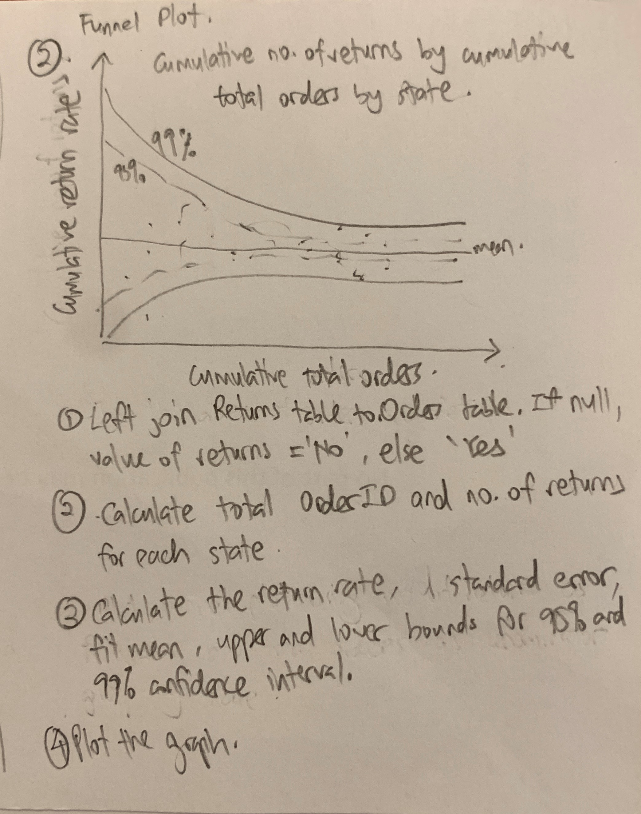

```{r setup, include=FALSE}
knitr::opts_chunk$set(  
  fig.retina = 3,
  echo = TRUE,
  eval = TRUE,
  warning = FALSE,
  message = FALSE)
```

# 1. Introduction

For this take home exercise, the data visualisation I have chosen to do is to show an unbiased comparison of order returned by state using the dataset in *Superstore-2021.xls*.

# 2. Sketch of Data Visualisation to be used

A funnel plot will be used to show the unbiased comparison of orders returned by state. The funnel plot is generally used to check for the existence of bias in a study.

Below shows the sketch of the plot that will be used.



# 3. Read in data and transform it for visualisation

### 3.1 Install and import libraries

For this visualisation, I will be using ggplot2 and ggplotly to create the funnel plot and include interactivity as well.

```{r}
packages = c('ggplot2', 'tidyverse', 'plotly', 'readxl')

for(p in packages){library
  if(!require(p, character.only = T)){
    install.packages(p)
  }
  library(p, character.only = T)
}
```

### 3.1 Read in data from excel file

Data used will be from *Superstore-2021.xls*. The dataset from the Orders and Returns sheets in the excel file will be required. 

```{r}
orders <- read_xls("data/Superstore-2021.xls",
                   sheet="Orders")
returns <- read_xls("data/Superstore-2021.xls",
                    sheet="Returns")
```

### 3.2 Join Orders and Returns table

Left join Returns table to Orders table. If returns value is null, convert it to 'No'. This indicates that the order was not returned.

```{r}

joined_table <- left_join(orders, returns, c('Order ID'='Order ID'))

joined_table$Returned <- joined_table$Returned %>%
  replace_na('No')

```

### 3.3 Count the number of returned orders and total orders by State

The total number of returned orders and total orders is needed to calculate the rate of returned orders and standard error of rate of returned orders by state. 

The below code calculates the total orders by state.

```{r}

total_orders <- joined_table %>%
  group_by(State) %>%
  summarise('Total'=n()) %>%
  ungroup()

```

The below code calculates total returns by State.

```{r}
total_returns <- joined_table %>%
  group_by(State) %>%
  filter(Returned == 'Yes') %>%
  summarise('Returns'=n()) %>%
  ungroup()

```

Join the *total_orders* and *total_returns* tables into one table. If any states have *null* values for total_returns, replace it with 0.

```{r}
final_table <- left_join(total_orders, total_returns, by=c('State'='State'))

final_table$Returns <- final_table$Returns %>%
  replace_na(0)

```

### 3.4 Calculate the return rate

The return rate can be calculated by dividing the total returns with total orders for each state. Only return rates above 0 will be considered.

```{r}
final_table <- final_table %>%
  mutate(rate=Returns/Total) %>%
  mutate(rate.se=sqrt(rate*(1-rate)/Total)) %>%
  filter(rate>0)
```

### 3.5 Calculate the weighted mean for the return rate

```{r}
fit_mean <- weighted.mean(final_table$rate, 1/final_table$rate.se^2)
```

### 3.6 Calculate the lower and upper limits of the 95% and 99% confidence interval

The 95% and 99% confidence interval will be calculated so that it can be plot out in the funnel plot.

```{r}
number.seq <- seq(1, max(final_table$Total), 1)
number.ll95 <- fit_mean - 1.96*sqrt(fit_mean*(1-fit_mean)/number.seq)
number.ul95 <- fit_mean + 1.96*sqrt(fit_mean*(1-fit_mean)/number.seq)
number.ll99 <- fit_mean - 3.29*sqrt(fit_mean*(1-fit_mean)/number.seq)
number.ul99 <- fit_mean + 3.29*sqrt(fit_mean*(1-fit_mean)/number.seq)

dfCI <- data.frame(number.ll95, number.ul95, number.ll99, number.ul99, number.seq, fit_mean)
```

# 4. Plot the static funnel plot

```{r}
p <- ggplot(final_table, aes(x=Total, y=rate)) +
  geom_point(aes(label=`State`), alpha=0.5, colour='blue') +
  geom_line(data=dfCI, aes(x=number.seq, y=number.ll95),
            size = 0.4, linetype = 'dashed', colour='grey40') + 
  geom_line(data = dfCI, aes(x=number.seq, y=number.ul95),
            size = 0.4, linetype = 'dashed', colour='grey40') +
  geom_line(data = dfCI, aes(x=number.seq, y=number.ll99),
            size = 0.4, colour='grey40') +
  geom_line(data = dfCI, aes(x=number.seq, y=number.ul99),
            size = 0.4, colour = 'grey40') +
  geom_hline(data = dfCI, aes(yintercept = fit_mean), size = 0.4,
             colour = 'grey40') + 
  coord_cartesian(ylim=c(0,0.6)) + 
  annotate('text', x=-100, y=0.4, label='95%', size=3, colour='grey40') +
  annotate('text', x=150, y=0.4, label='99%', size=3, colour='grey40') +
  annotate('text', x=3200, y=0.2, label=round(fit_mean, digits = 3), size=3, colour='grey40') +
  ggtitle('Cumulative Return Rate by Cumulative Total Orders Number by State') +
  xlab('Cumulative Total Orders') +
  ylab('Cumulative Return Rate') +
  theme_light() +
  theme(plot.title = element_text(size = 12))

p

```

# 5. Add interactivity to the static plot using ggplotly

Placing the ggplot in ggplotly will allow tooltips to be shown when mouse is hovering over the points.

```{r}
ggplotly(p, tooltip = c('label', 'x', 'y'))
```

# 6. Conclusion

The funnel plot makes is possible to deduce which states have a high return rate based on the mean return rate for all states. States that have points outside of the 95% or 99% confidence interval means that statistically, these states have a higher return rate when compared to the orders from all stores in the U.S. This provides an unbiased comparison on the return rates by each state.
